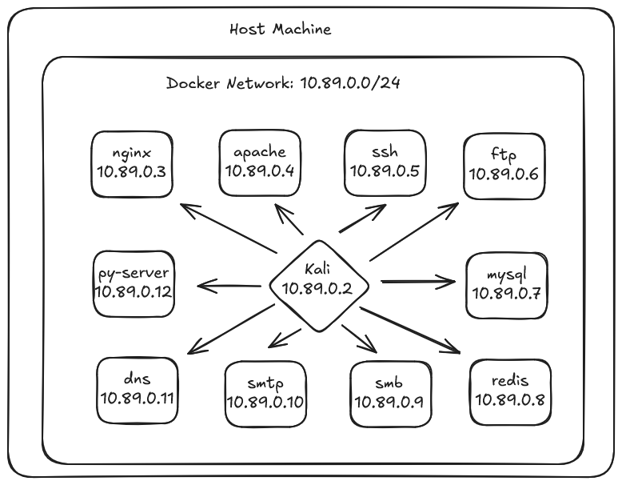

# 🎯 DOCKER-LAB - Pentest Training Environment

[](https://www.docker.com/)
[](LICENSE)
[](CONTRIBUTING.md)
[]()

> 🔐 Ambiente Docker completo e isolado para treinamento prático em **Nmap**, **Red Team** e técnicas de **Pentesting**

<p align="center">
  
</p>

---

## 📋 Índice

- [✨ Features](#-features)
- [🚀 Quick Start](#-quick-start)
- [🏗️ Arquitetura](#-arquitetura)
- [📚 Documentação](#-documentação)
- [🎯 Desafios CTF](#-desafios-ctf)
- [🤝 Contribuindo](#-contribuindo)
- [⚠️ Avisos Legais](#-avisos-legais)

---

## ✨ Features

- 🐳 **10+ serviços vulneráveis** isolados em containers Docker
- 🎓 **Desafios CTF progressivos** do nível iniciante ao avançado
- 🤖 **Scripts de automação** para scans e análises ([em desenvolvimento](TODO.md))
- 📊 **Análise estruturada** de resultados com Python ([em desenvolvimento](TODO.md))
- 📚 **Documentação completa** com exemplos práticos e write-ups
- 🔒 **100% offline e seguro** - ambiente isolado para aprendizado
- 🎯 **Vulnerabilidades reais** - command injection, weak auth, information disclosure
- 🌐 **Rede customizada** com IPs fixos e DNS interno


---

## 🚀 Quick Start

### Pré-requisitos

```bash
# Verificar instalação do Docker
docker --version
docker compose version
```

Requisitos mínimos:
- **Docker**: 20.10+
- **Docker Compose**: 2.0+
- **RAM**: 4GB disponível
- **Disco**: 10GB livre

### Instalação

```bash
# 1. Clonar o repositório
git clone https://github.com/dny8888/vuln-labs.git
cd vuln-labs

# 2. Subir o laboratório
docker compose up -d --build

# 3. Verificar status dos containers
docker compose ps

# 4. Entrar no container atacante
docker exec -it lab_attacker /bin/bash
```

### Primeiro Scan

Dentro do container `lab_attacker`:

```bash
# Descobrir hosts ativos
nmap -sn 10.89.0.0/24

# Scan rápido de portas comuns
nmap -sS -Pn -T4 --open -p 21,22,80,443,445,3306,6379,9999 10.89.0.0/24

# Enumeração completa do serviço vulnerável
nmap -sV -sC -p9999 lab_pyserver
```

### Derrubar o Lab

```bash
# No host (fora do container)
docker compose down --volumes
```

---

## 🏗️ Arquitetura

### Topologia da Rede


### Serviços Disponíveis

| Container | IP | Porta(s) | Descrição | Vulnerabilidades |
|-----------|---------|----------|-----------|------------------|
| `lab_attacker` | 10.89.0.2 | - | Kali Linux (atacante) | - |
| `lab_nginx` | 10.89.0.3 | 80 | Web server Nginx | Configurações default |
| `lab_apache` | 10.89.0.4 | 80 | Web server Apache | Configurações default |
| `lab_ssh` | 10.89.0.5 | 22 | OpenSSH Server | Weak password |
| `lab_ftp` | 10.89.0.6 | 21 | FTP Server | Anonymous login |
| `lab_mysql` | 10.89.0.7 | 3306 | MySQL Database | Root access |
| `lab_redis` | 10.89.0.8 | 6379 | Redis Cache | No authentication |
| `lab_smb` | 10.89.0.9 | 445 | Samba/SMB | Open shares |
| `lab_smtp` | 10.89.0.10 | 25,8025 | Mail Server | Open relay |
| `lab_dns` | 10.89.0.11 | 53 | DNS Server | Zone transfer |
| `lab_pyserver` | 10.89.0.12 | 9999 | **Custom Vuln Service** | ⚠️ Command Injection, Weak Auth |

---

## 📚 Documentação

A documentação está organizada por tópicos:

### 🎓 Guias de Uso

1. **[Setup Inicial](docs/01-setup.md)** - Instalação e configuração
2. **[Descoberta de Hosts](docs/02-host-discovery.md)** - Host discovery com nmap
3. **[Port Scanning](docs/03-port-scanning.md)** - Técnicas de scan de portas
4. **[Service Enumeration](docs/04-service-enumeration.md)** - Enumeração de serviços
5. **[NSE Scripts](docs/05-nse-scripts.md)** - Uso avançado de scripts Nmap
6. **[Exploitation Guide](docs/06-exploitation-guide.md)** - Guia de exploração
7. **[Reporting](docs/07-reporting.md)** - Documentação de achados

### 🔧 Referências Técnicas

- **[NMAP Cheatsheet](docs/nmap-cheatsheet.md)** *(em desenvolvimento)*
- **[Common Vulnerabilities](docs/vulnerabilities.md)** *(em desenvolvimento)*
- **[Troubleshooting](docs/troubleshooting.md)** *(em desenvolvimento)*

---

## 🎯 Desafios CTF

> 🚧 **Em desenvolvimento** - Desafios CTF completos serão adicionados em breve!

Preview dos desafios planejados:

- 🥉 **Nível Iniciante**: Descoberta de rede, identificação de serviços
- 🥈 **Nível Intermediário**: Enumeração SMB, SSH, MySQL
- 🥇 **Nível Avançado**: Exploração do serviço vulnerável, command injection
- 🏆 **Desafio Bônus**: Script de automação completo

**Status**: Veja [CHALLENGES.md](CHALLENGES.md) para detalhes *(arquivo será criado em breve)*

---

## 🛠️ Scripts de Automação

> 🚧 **Em desenvolvimento** - Scripts de automação em Python e Bash

Planejados:
- `auto_scan.sh` - Scan automatizado completo
- `analyze_results.py` - Análise e parsing de resultados
- `setup_lab.sh` - Deploy automatizado
- `reset_lab.sh` - Reset do ambiente

**Status**: Veja [TODO.md](TODO.md) para acompanhar o progresso

---

## 📊 Roadmap

### ✅ Versão 1.0 (Atual)
- [x] Ambiente Docker funcional
- [x] 10+ serviços vulneráveis
- [x] Rede isolada com IPs fixos
- [x] DNS interno configurado
- [x] Documentação básica
- [x] Serviço vulnerável customizado

### 🚧 Versão 1.1 (Em Desenvolvimento)
- [ ] Desafios CTF completos
- [ ] Scripts de automação
- [ ] Análise de resultados
- [ ] Write-ups de exemplo
- [ ] Diagrama visual da rede

### 🔮 Versão 2.0 (Futuro)
- [ ] Container Windows Server + Active Directory
- [ ] Metasploitable 2/3 integrado
- [ ] Sistema de logging (ELK Stack)
- [ ] Dashboard Grafana
- [ ] CI/CD para testes

Veja o [TODO.md](TODO.md) completo para mais detalhes.

---

## 🤝 Contribuindo

Contribuições são muito bem-vindas! 🎉

### Como Contribuir

1. Fork o projeto
2. Crie uma branch para sua feature (`git checkout -b feature/AmazingFeature`)
3. Commit suas mudanças (`git commit -m 'Add some AmazingFeature'`)
4. Push para a branch (`git push origin feature/AmazingFeature`)
5. Abra um Pull Request

Veja [CONTRIBUTING.md](CONTRIBUTING.md) para diretrizes detalhadas *(arquivo será criado)*.

### Áreas que Precisam de Ajuda

- 📝 Melhorias na documentação
- 🐛 Correção de bugs
- ✨ Novos serviços vulneráveis
- 🎯 Criação de desafios CTF
- 🤖 Scripts de automação
- 🎨 Melhorias visuais

---

## ⚠️ Avisos Legais

### ⚖️ Uso Ético e Legal

Este laboratório foi criado **exclusivamente para fins educacionais**.

**🚫 NÃO UTILIZE estas técnicas em:**
- Sistemas sem autorização expressa e por escrito
- Redes corporativas sem permissão
- Infraestrutura de terceiros
- Qualquer ambiente de produção

**✅ USE APENAS em:**
- Este laboratório isolado
- Ambientes controlados de CTF
- Sistemas de sua propriedade
- Plataformas autorizadas (HackTheBox, TryHackMe)

### 📜 Responsabilidade

- O autor **não se responsabiliza** pelo uso indevido das ferramentas e técnicas
- Uso inadequado pode resultar em **consequências legais graves**
- Sempre obtenha **autorização por escrito** antes de testar sistemas reais
- Respeite leis locais e regulamentações sobre testes de segurança

### 🔒 Segurança do Lab

Este lab é projetado para ser **isolado**:
- ✅ Rede Docker interna (sem exposição ao host)
- ✅ Sem port binding para localhost
- ✅ Containers sem acesso à internet (exceto DNS upstream)

**Boas práticas**:
- Não exponha serviços vulneráveis à internet
- Mantenha o lab atualizado
- Use apenas em máquinas dedicadas/VMs

---

## 📄 Licença

Este projeto está licenciado sob a **MIT License** - veja o arquivo [LICENSE](LICENSE) para detalhes.

---

## 🙏 Agradecimentos

- Comunidade de cibersegurança por compartilhar conhecimento
- Desenvolvedores do Nmap
- Projetos open source que inspiraram este lab

---

## 📞 Contato e Suporte

- 🐛 **Bugs**: Abra uma [issue](https://github.com/dny8888/vuln-labs/issues)
- 💡 **Sugestões**: Envie uma [pull request](https://github.com/dny8888/vuln-labs/pulls)
- 💬 **Dúvidas**: Use as [Discussions](https://github.com/dny8888/vuln-labs/discussions)


---
## Disclaimer
>Como o intuito deste repositório é para a prática de pentest, boa parte da documentação foi gerada por IA, entretanto foi revisada com carinho por mim, caso encontre uma generalidade incomoda, agradeço seu reporte. A configuração do serviço docker e outros scripts, foram resultado de vários testes em minha jornada de aprendizado, quem envolveram também consultas a forums e conversas com IA.
---


<p align="center">
  <b>⭐ Se este projeto foi útil, considere dar uma estrela! ⭐</b>
</p>

<p align="center">
  Feito com ❤️ para a comunidade de cibersegurança
</p>

---

## 📚 Links Úteis

### Aprendizado
- [Nmap Official Documentation](https://nmap.org/book/)
- [TryHackMe - Nmap Room](https://tryhackme.com/room/furthernmap)
- [HackTheBox Academy](https://academy.hackthebox.com/)
- [OWASP Testing Guide](https://owasp.org/www-project-web-security-testing-guide/)

### Ferramentas
- [Kali Linux Tools](https://www.kali.org/tools/)
- [SecLists](https://github.com/danielmiessler/SecLists) - Wordlists
- [PayloadsAllTheThings](https://github.com/swisskyrepo/PayloadsAllTheThings)